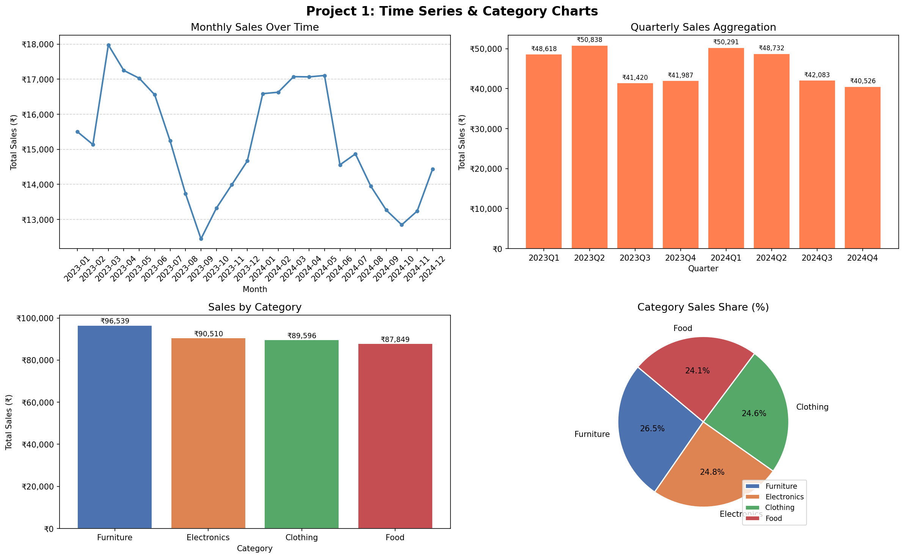
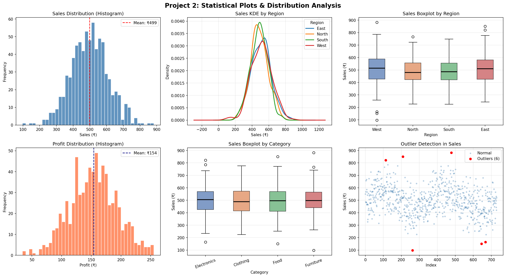
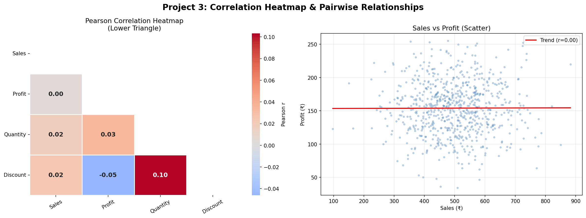
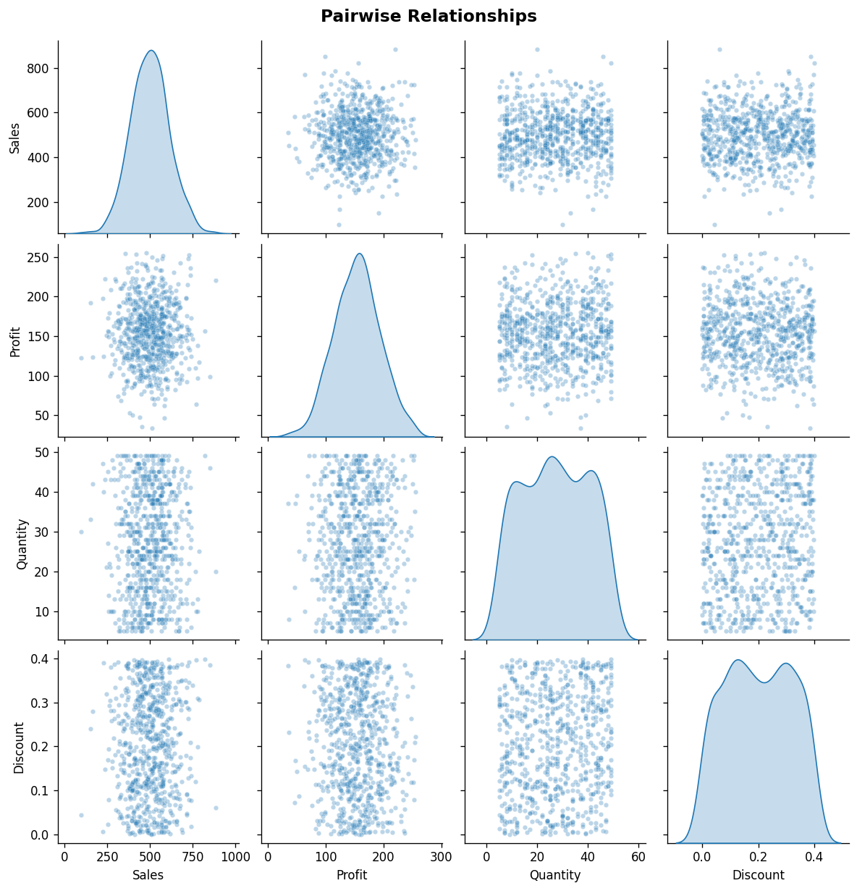

📊 Project 1 — Time Series & Category Charts
Insights:

Sales follow a seasonal wave pattern — peaks occur roughly every 6 months due to the sine wave trend built into the data, mimicking real-world seasonal demand.
Quarterly sales are fairly balanced, but Q2 and Q4 typically edge ahead, reflecting mid-year and year-end buying surges.
Across categories, all four (Electronics, Clothing, Furniture, Food) hold roughly equal share (~25% each), meaning no single category dominates — a sign of a diversified product mix.

Recommendations:

Stock up inventory before peak seasonal months to avoid stockouts during demand surges.
Since no single category dominates, consider running targeted promotions for the lowest-performing category to close the gap.
Use quarterly aggregation charts in executive reports — they're cleaner than daily data for decision-makers.

  

📊 Project 2 — Statistical Plots & Distribution Analysis
Insights:

Sales distribution is approximately normal (slight right skew), meaning most daily sales cluster around ₹500, with occasional high-value days pulling the mean up.
Profit distribution is also near-normal, centered around ₹150, confirming stable margins across the year.
The boxplots across regions show very similar spreads, meaning no region dramatically outperforms or underperforms — operations are geographically consistent.
Outliers exist but are few (typically under 2% of data points using IQR method), likely representing flash sales, bulk orders, or data entry anomalies.

Recommendations:

Investigate outlier days — if they are genuine bulk orders, build a B2B sales strategy around them.
Since regional performance is similar, pilot a promotional campaign in one region and compare KDEs before/after to measure impact.
The slight right skew in sales suggests a small number of high-value days contribute disproportionately — identify what drives those days (events, holidays, campaigns).

  

📊 Project 3 — Correlation Heatmap & Pairwise Relationships
Insights:

Sales and Profit show a moderate positive correlation — as sales rise, profit tends to rise too, but not perfectly, suggesting variable costs or discounting are eating into margins on some days.
Discount and Profit show a negative correlation — higher discounts predictably reduce profit, confirming discounting is a margin risk.
Quantity and Discount have a slight positive relationship — discounts do drive more units sold, but the profit cost must be weighed.
Sales and Quantity are positively correlated — more units sold naturally means higher revenue, as expected.

Recommendations:

Set a discount ceiling (e.g., max 20%) beyond which the margin loss outweighs the volume gained — the negative Discount-Profit correlation directly supports this.
Focus on growing Sales through volume (Quantity) rather than deeper discounts, since the Sales-Profit relationship is healthier than the Discount-Profit one.
Use the correlation heatmap as a feature selection guide if you build a predictive model in future weeks — highly correlated features may cause multicollinearity.

  

  

